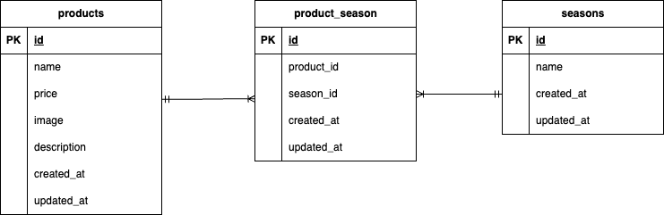

# mogitate(フリマサイト)

## 環境構築

- リポジトリをクローン  

  ターミナルを起動

  ```bash
  git clone git@github.com:e-misora/test-mogitate.git  
  ```
  ```bash
  cd test-mogitate
  ```
- docker のビルド 起動  
  ```bash
  docker-compose up -d --build  
  ```
- 環境変数を設定  
  ```bash
  cd src  
  ```
  ```bash
  cp .env.example .env  
  ```
  .env ファイルを編集して必要な値を設定

  12行目
  ```bash:.env
  DB_HOST=mysql
  ```
  15行目
  ```bash
  DB_DATABASE=laravel_db
  DB_USERNAME=laravel_user
  DB_PASSWORD=laravel_pass
  ```

- Laravel パッケージのインストール  
  ```bash
  docker-compose exec php bash  
  ```
  ```bash
  composer install
  ```
- アプリケーションを実行するためのキーを作成  
  ```bash
  docker-compose exec php bash  
  ```
  ```bash
  php artisan key:generate
  ```
- マイグレーション実行  
  ```bash
  docker-compose exec php bash  
  ```
  ```bash
  php artisan migrate
  ```
- シーディング実行  
  ```bash
  docker-compose exec php bash  
  ```
  ```bash
  php artisan db:seed
  ```
- fruits-imgディレクトリをpublicからstorage/app/publicに移動

- 画像を表示するためのシンボリックリンクを作成  
  ```bash
  docker-compose exec php bash  
  ```
  ```bash
  php artisan storage:link
  ```


## 使用技術（実行環境）

- php:
- Laravel:
- MySQL:8.0.26
- nginx:1.21.1

## ER図



## URL

- 商品一覧画面  
  http://localhost/products
- DB(データベーステーブル)  
  http://localhost:8080/

